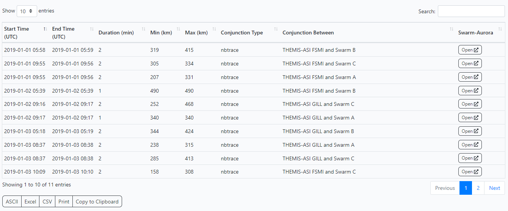
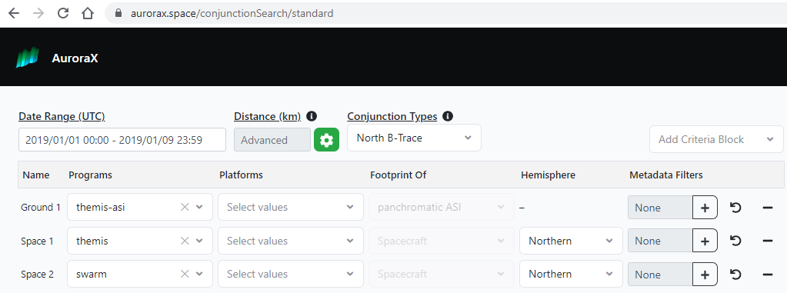

# Searching and Exploring Conjunctions

With AuroraX, you can use the search engine to perform various types of conjunction search queries. We'll have a look at some examples in the sections below.

Note that the examples we go through will be using the [Conjunction Search](https://aurorax.space/conjunctionSearch/standard) web interface.

## Your first conjunction search

On the [Conjunction Search](https://aurorax.space/conjunctionSeach/standard) web interface, we have several examples pre-configured to help you get a sense of what kinds of searches you can do. We'll start by going through Example 1 - a search to find conjunctions between two THEMIS ASI sites (Fort Smith and Gillam), and any Swarm spacecraft (Swarm A, B, or C). The timeframe is 3 days at the beginning of 2020, and the maximum distance is 500km. Other details are that we're restricting the search to only evaluate North B-Trace magnetic footprints, and times where Swarm spacecraft geographic location is in the northern hemisphere.

[](../_extras/img/conjunction_search_basic_search_screenshot1.png)

## Exploring results with Swarm-Aurora

When this search finishes after a couple seconds, the search returned 11 results. You can then visualize the conjunctions using Swarm-Aurora via the "Open" buttons in the results table, or using the "Open all results" Swarm-Aurora button (in the set of tools buttons, above the search button).

[](../_extras/img/conjunction_search_basic_search_screenshot2.png)

## Triple-conjunction searches

Criteria blocks are what we call each "Ground X" or "Space X" row in the query table. These criteria blocks are logically AND'd together, where-as specifications within a criteria block field (ie. platforms) are logically OR'd.

We can add another criteria block to our search to find "triple" conjunctions: conjunctions between three different data sources. Example 5 on the Conjunction Search webpage is one such search.

[](../_extras/img/conjunction_search_triple_screenshot1.png)

This search returns 24 results, with one being a conjunction between "THEMIS-ASI NRSQ and THEMIS-A and Swarm A". Note the AND statements and how there exists one data source from each criteria block.

## Using metadata filters

Conjunction searches can be made more complex by leveraging metadata that is entered into ephemeris records in the database. This metadata is entirely flexible, and up to the maintainer of a data source's ephemeris records.

Using the "metadata filters" section of a criteria block, we can add different values for our conjunction results to filter for. The metadata filters is the section where you can specify that results should include only conjunctions where a spacecraft was in the plasma sheet, or a machine learning model thinks that there's Amorphous Pulsating Aurora (APA) is in the FoV, or if an instrument onboard a spacecraft was operating (ie. FAI was collecting data on ePOP).

Example 7 on the Conjunction Search webpage illustrates the use of the metadata filters and a machine learning model. Below is a screenshot of the metadata filters modal for this example. You can also change the logical expression that the search engine uses when evaluating multiple metadata filters. By default, it is a logical "AND", but can be adjusted in the modal.

[](../_extras/img/conjunction_search_metadata_filters_screenshot1.png)

To give a brief glimpse as to how the search engine evaluates these metadata filters, we can look at some ephemeris data. Below is a single 1-minute ephemeris record for the Swarm A spacecraft.

```json hl_lines="27-39"
{
  "data_source": {
    "identifier": 3,
    "program": "swarm",
    "platform": "swarma",
    "instrument_type": "footprint",
    "source_type": "leo",
    "display_name": "Swarm A"
  },
  "epoch": "2020-01-01T00:00:00",
  "location_geo": {
    "lat": 76.696365,
    "lon": 103.03342
  },
  "location_gsm": {
    "lat": 76.696365,
    "lon": 103.03342
  },
  "nbtrace": {
    "lat": 76.86447,
    "lon": 103.15613
  },
  "sbtrace": {
    "lat": -58.288635,
    "lon": 114.33702
  },
  "metadata": {
    "state": "definitive",
    "tii_on": true,
    "nbtrace_region": "north mid-latitude",
    "sbtrace_region": "south mid-latitude",
    "radial_distance": 6802.930422181797,
    "tii_quality_viy": 0,
    "tii_quality_viz": 0,
    "tii_quality_vixh": 0,
    "tii_quality_vixv": 1,
    "spacecraft_region": "nightside magnetosphere",
    "radial_trace_region": "north mid-latitude"
  }
}
```

The metadata section of ephemeris records is what is used when evaluating metadata filters. The specification for metadata filters - such as descriptions and allowed values - are outlined in a data source' ephemeris metadata schema.

??? abstract "Click to view ephemeris metadata schema for Swarm A"

    Below is the data source record for Swarm A which contains the `ephemeris_metadata_schema` specification.

    ```json
    {
      "identifier": 3,
      "program": "swarm",
      "platform": "swarma",
      "instrument_type": "footprint",
      "source_type": "leo",
      "display_name": "Swarm A",
      "metadata": {},
      "owner": "dchaddoc@ucalgary.ca",
      "maintainers": [],
      "ephemeris_metadata_schema": [
        {
          "field_name": "nbtrace_region",
          "description": "Region based on where the magnetic field line that passes through the spacecraft intersects the Earth's surface in the Earth's northern magnetic hemisphere",
          "data_type": "string",
          "allowed_values": [
            "north polar cap",
            "north cusp",
            "north cleft",
            "north auroral oval",
            "north mid-latitude",
            "low latitude"
          ],
          "searchable": true
        },
        {
          "field_name": "sbtrace_region",
          "description": "Region based on where the magnetic field line that passes through the spacecraft intersects the Earth's surface in the Earth's southern magnetic hemisphere",
          "data_type": "string",
          "allowed_values": [
            "south polar cap",
            "south cusp",
            "south cleft",
            "south auroral oval",
            "south mid-latitude",
            "low latitude"
          ],
          "searchable": true
        },
        {
          "field_name": "radial_distance",
          "description": "Distance spacecraft is from Earth in kilometers",
          "data_type": "double",
          "allowed_values": [],
          "searchable": true
        },
        {
          "field_name": "spacecraft_region",
          "description": "Region based on the spacecraft's position within the magnetosphere",
          "data_type": "string",
          "allowed_values": [
            "interplanetary medium",
            "dayside magnetosheath",
            "nightside magnetosheath",
            "dayside magnetosphere",
            "nightside magnetosphere",
            "dayside plasmasphere",
            "nightside plasmasphere",
            "plasma sheet",
            "tail lobe",
            "low latitude boundary layer",
            "high latitude boundary layer"
          ],
          "additional_description": "A spacecraft can occupy only one region of this region type at any given time. The North and South Mid-Latitude regions are defined as the two bands about the Earth that extend from +30 degrees latitude to the North Auroral Oval, and -30 degrees latitude to the South Auroral Oval. The Low-Latitude is the band that extends from +30 degrees latitude to -30 degrees latitude.",
          "searchable": true
        },
        {
          "field_name": "radial_trace_region",
          "description": "Region based on the location on the Earth's surface where a straight line would intersect when connecting the spacecraft and the Earth's center",
          "data_type": "string",
          "allowed_values": [
            "north polar cap",
            "south polar cap",
            "north cusp",
            "south cusp",
            "north cleft",
            "south cleft",
            "north auroral oval",
            "south auroral oval",
            "north mid-latitude",
            "south mid-latitude",
            "low latitude"
          ],
          "searchable": true
        },
        {
          "field_name": "state",
          "description": "Data is based on predictive or definitive information",
          "data_type": "string",
          "allowed_values": [
            "predictive",
            "definitive"
          ],
          "searchable": true
        },
        {
          "field_name": "tii_on",
          "description": "Indicates that the TII instrument was operational at this time.",
          "data_type": "bool",
          "allowed_values": [
            "true",
            "false"
          ],
          "additional_description": "Retrieved from TII 2Hz v0301 files. Further information and documentation found at http://efi.phys.ucalgary.ca/tii-cross-track-ion-flow-dataset-0301-released/",
          "searchable": true
        },
        {
          "field_name": "tii_quality_vixh",
          "description": "Quality flag for Vixh data (along-track component from the horizontal sensor)",
          "data_type": "int",
          "allowed_values": [],
          "additional_description": "Retrieved from TII 2Hz v0301 files. Further information and documentation found at http://efi.phys.ucalgary.ca/tii-cross-track-ion-flow-dataset-0301-released/",
          "searchable": true
        },
        {
          "field_name": "tii_quality_vixv",
          "description": "Quality flag for Vixv data (along-track component from the vertical sensor)",
          "data_type": "int",
          "allowed_values": [],
          "additional_description": "Retrieved from TII 2Hz v0301 files. Further information and documentation found at http://efi.phys.ucalgary.ca/tii-cross-track-ion-flow-dataset-0301-released/",
          "searchable": true
        },
        {
          "field_name": "tii_quality_viy",
          "description": "Quality flag for Viy data (to the right, observer facing forward)",
          "data_type": "int",
          "allowed_values": [],
          "additional_description": "Retrieved from TII 2Hz v0301 files. Further information and documentation found at http://efi.phys.ucalgary.ca/tii-cross-track-ion-flow-dataset-0301-released/",
          "searchable": true
        },
        {
          "field_name": "tii_quality_viz",
          "description": "Quality flag for Viz data (downward)",
          "data_type": "int",
          "allowed_values": [],
          "additional_description": "Retrieved from TII 2Hz v0301 files. Further information and documentation found at http://efi.phys.ucalgary.ca/tii-cross-track-ion-flow-dataset-0301-released/",
          "searchable": true
        }
      ],
      "data_product_metadata_schema": []
    }
    ```

## Advanced distances

As conjunction searches grow to have 2+ criteria blocks, this introduces the need to sometime specify the distances between each criteria block. For example, if you had one ground and two space criteria blocks, you may not care if the two spacecrafts are close to each other. You may only care that the two spacecrafts are close to the ground one.

This flexibility in distances is where the "advanced distances" component comes into play. By clicking the :material-cog: icon beside the distance input, you can explore this capability. When the distance is left empty for a matching, this means that the search algorithm shouldn't care about its distance when deriving conjunctions.

Below is the advanced distanced modal for example 5 on the Conjunction Search webpage. In this example, we are searching for triple conjunctions between one ground and two space, where the maximum distance between the ground and each space is 900 km, and the distance between the two space is not a restriction.

[](../_extras/img/conjunction_search_advanced_distances_screenshot1.png)

## Searching Ephemeris and Data Product Records

In addition to conjunction searches, the AuroraX search engine can also be used to search the database for ephemeris and data product records. Queries are very similar to conjunction searches, with the ability to use metadata filters in the exact same way. 

You can easily do an ephemeris search to retrieve all 1-minute records for a set of THEMIS ASIs where a machine learning model thinks APA is in the FoV. With this information, you can feed it into other research you're doing locally (outside of the AuroraX platform).

## Next step

Now that we've dipped our toes into searching for conjunctions, we'll explore the the search engine's capabilities of retrieving ephemeris and data product records.

[Next step&nbsp;&nbsp;:octicons-arrow-right-16:](exploring_keograms.md){.md-button}
